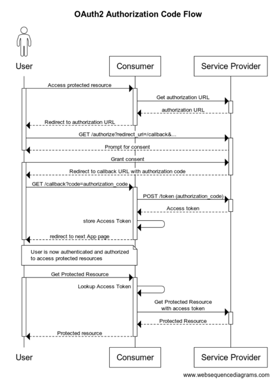

# OAuth2 Email Bridge PoC

The application suite whose source is contained within this folder serves as a Proof of Concept (PoC)
and example implementation of a web application leveraging [OAuth2] to allow users to access their
e-mail resources hosted on e-mail Service Providers (e.g., Google Gmail, Microsoft Outlook) to satisfy
requirements of a Consumer (such as this PoC) application.

## Components

The (source) components of this project include those in the sub-folders:

- [backend](./backend/README.md)
- [frontend](./frontend/README.md)

## Challenge

Come up with a simple backend & frontend allowing users to send & receive e-mails for
a particular application.  The following set of "email backbones" should be supported:

- Google GMail
- Microsoft Outlook

The authorization protocol [OAuth2] will be used to grant the application access to the
needed APIs on these e-mail backbones.

## OAuth2 Sequence Overview

The following sequence depicts a generalization of an [OAuth2] flow of control used by a Consumer
app (such as this one) to gain authorization to access functionality in a Service Provider (such
as Google GMail) on behalf of a user.



If you paste the following text into the [websequencediagrams.com App](https://www.websequencediagrams.com/app),
you can customize the sequence and explore the interaction in more detail, as your needs require.
```wsd
title OAuth2 Authorization Code Flow

actor User as User
participant Consumer as Backend
participant Service Provider as OAuth2

User -> Backend: Access protected resource
activate User
activate Backend
Backend -> OAuth2: Get authorization URL
activate OAuth2
OAuth2 --> Backend: authorization URL
deactivate OAuth2
Backend --> User: Redirect to authorization URL
deactivate Backend
User -> OAuth2: GET /authorize?redirect_uri=/callback&...
activate OAuth2
OAuth2 --> User: Prompt for consent
deactivate User
User -> OAuth2: Grant consent
activate User
OAuth2 --> User: Redirect to callback URL with authorization code
deactivate OAuth2
User -> Backend: GET /callback?code=authorization_code
activate Backend
Backend -> OAuth2: POST /token (authorization_code)
activate OAuth2
OAuth2 --> Backend: Access token
deactivate OAuth2
Backend -> Backend: store Access Token
Backend --> User: redirect to next App page
note over User, Backend: User is now authenticated and authorized\nto access protected resources
deactivate Backend
deactivate User
User -> Backend: Get Protected Resource
activate User
activate Backend
Backend -> Backend: Lookup Access Token
Backend -> OAuth2: Get Protected Resource\nwith access token
activate OAuth2
OAuth2 --> Backend: Protected Resource
deactivate OAuth2
Backend --> User: Protected resource
deactivate Backend
deactivate User
```

## Additional Resources

There are _lots!_ of relevant and interesting resources and guides on the internet to help a developer
leverage OAuth2 for authorization to access Service Providers in their applications.  Unfortunately,
many of these provide conflicting or out-of-date information.

Some of the more helpful resources I've found relevant to this project include:

- [what-is-oauth](https://www.varonis.com/blog/what-is-oauth)
- [medium.com/@tony.infisical](https://medium.com/@tony.infisical/guide-to-using-oauth-2-0-to-access-google-apis-dead94d6866d)
- [oauth2-diagrams](https://www.gabriel.urdhr.fr/2023/02/06/oauth2-diagrams/)
- [authorization-code-flow](https://auth0.com/docs/get-started/authentication-and-authorization-flow/authorization-code-flow)
- [oauth.net](https://oauth.net/2/)
- [ngrok](https://ngrok.com/)

[OAuth2]: https://oauth.net/2/